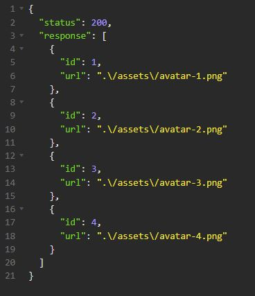
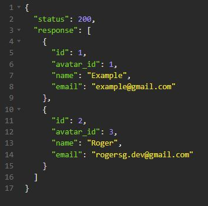
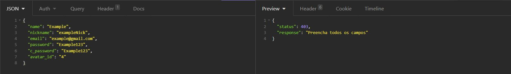
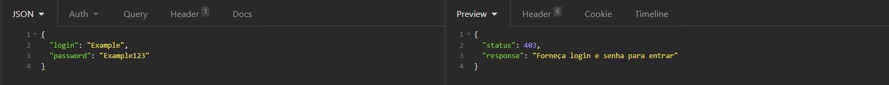

<h1>Wallet Server</h1>

  <h2>Sumário</h2>
    <ul>
      <li><a href="#sobre">Sobre</a></li>
      <li><a href="#requisitos">Pré-requisitos</a></li>
      <li><a href="#instalacao">Rodando a aplicação</a></li>
      <li><a href="#galeria">Galeria</a></li>
      <li><a href="#nota">Notas</a></li>
    </ul>
    
  <h2 id='sobre'>💬 Sobre</h2>
  
Este é o server responsável pelo CRUD da aplicação Wallet desenvolvida em React.js

  
A aplicação é fictícia e simula um software de gestão financeira. Este projeto é o limiar para a conclusão do curso de desenvolvimento em React disponibilizado pela plataforma GamaAcademy.

  
  <h2 id='requisitos'>🧩 Pré-requisitos para rodar a aplicação</h2>
  
Tenha certeza de que seu dispositivo tem o xampp instalado, se não houver instale-o no link:

  <ul><a href="https://www.apachefriends.org/pt_br/download.html">https://www.apachefriends.org/pt_br/download.html</a></ul>
  
É necessário a instalação do PHP, Apache e MySQL.

  
Após a instalação do xampp, siga os seguintes passos para importar o banco de dados:

  <ul>
    <li>Abra o XAMPP Control Panel em seu dispositivo;</li>
    <li>Inicie o Apache e o MySQL;</li>
    <li>Em seu navegador, entre no link "localhost/phpmyadmin";</li>
    <li>Crie um novo banco de dados chamado "bd_wallet";</li>
    <li>Acesse o banco de dados criado;</li>
    <li>Na parte superior da página, clique em "Importar";</li>
    <li>Clique no botão "Procurar..." e selecione o banco de dados localizado na Pasta "..\WalletServer\database\bd_wallet.sql" do arquivo presente neste repositório;</li>
    <li>Desça a página e clique no botão "Importar".</li>
  </ul>
  
  <h2 id='instalacao'>🚀 Rodando a Aplicação</h2>
  
  
Depois de configurar o Banco de dados em sua máquina, mova a pasta raiz do projeto para a pasta "htdocs" do Xampp, localizada por padrão em "C:\xampp\htdocs\"

  
Tudo pronto! O projeto já estará rodando no localhost de seu dispositivo, agora é só aproveitar e utilizar a API. Recomendo o uso do Insomnia para a visualização das requisições feitas à API.

  
  <h2 id='galeria'>🖼 Galeria</h2>
  
Rota Avatar - Index

  
  
  
Rota Users - Index

  
  
  
Rota Users - signUp

  
  
  
Rota Users - Login

  
  
  
  <h2 id='nota'>📃 Notas</h2>
  
Qualquer dúvida entre em contato com o Robert da Silva Gomes pelo Slack e peça para me contatar.

  
Projeto feito exclusivamente para estudos, ou seja, sem visar nenhuma forma de lucro.

